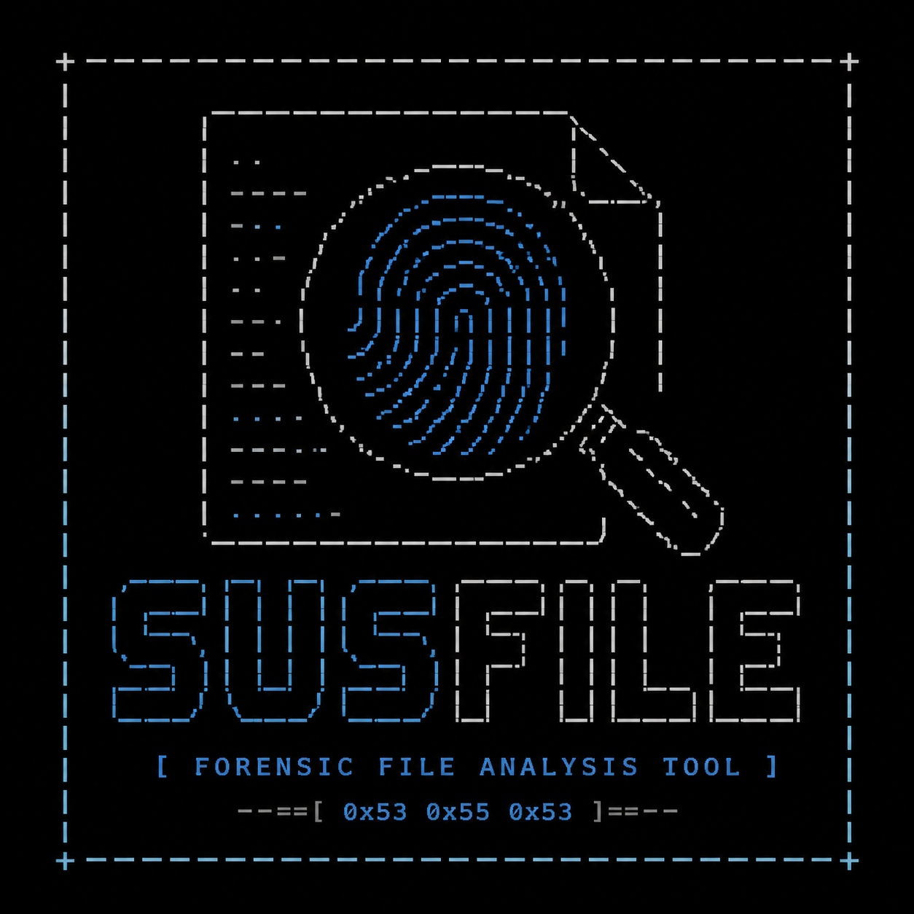
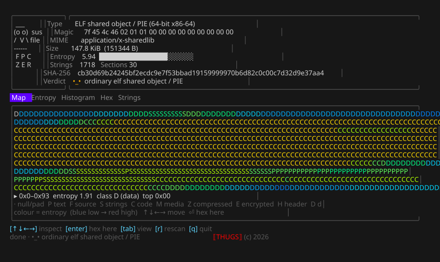
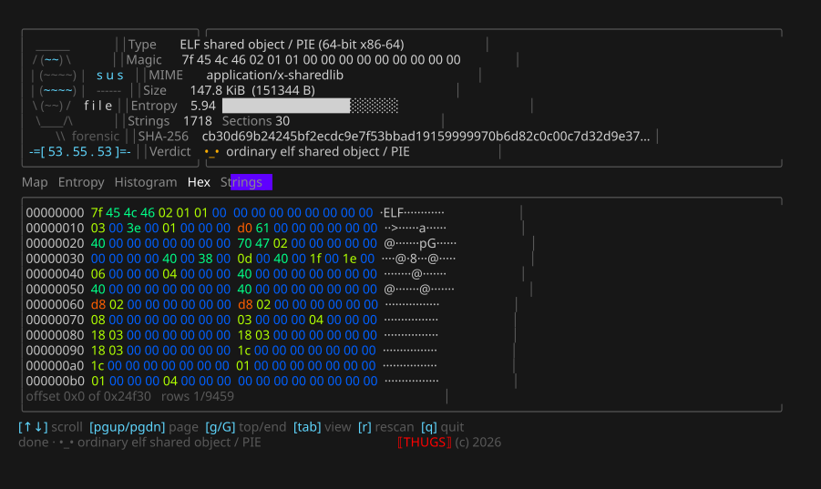
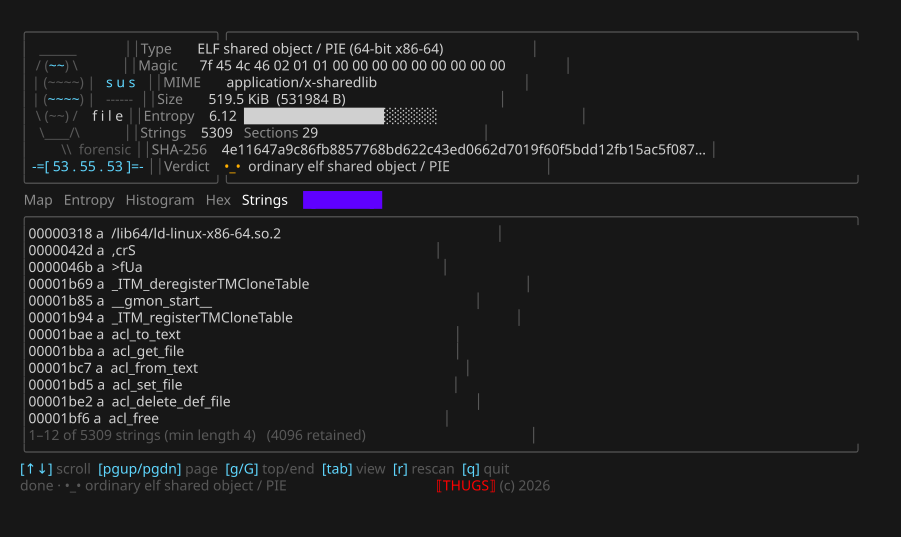

<div align="center">



# susfile

**A CLI file-forensics visualiser — see what a file *is* at a glance.**

Magic header · MIME & type · entropy · hashes · ELF/PE/Mach-O structure — with a
**defrag-screen "file map"** of classified byte regions as the centrepiece.

<br/>


<br/>

<samp>one static binary · four Linux targets · `.deb` packages · zero network, zero telemetry</samp>

</div>

<br/>

> [!NOTE]
> **v0.1.1 is out** — [release](https://github.com/kawaiipantsu/susfile/releases/tag/v0.1.1)
> with static Linux binaries and `.deb` packages for `amd64` / `i386` / `arm64` /
> `armhf`. It is a young tool: the block classifier and the verdict are
> heuristics (see [`docs/analysis.md`](docs/analysis.md) and the
> [known limitations](CHANGELOG.md)). Ideas and bug reports very welcome.

<br/>

## 📑 Table of Contents

- [✨ Why susfile](#why)
- [🖥️ What it looks like](#look)
- [🧠 How the file map is read](#map)
- [📦 Install](#install)
- [🚀 Usage](#usage)
- [🧪 Development](#development)
- [🗺️ Roadmap](#roadmap)
- [🔐 Security](#security)
- [📄 License](#license)

<br/>

<a id="why"></a>

## ✨ Why susfile

`file` tells you a guess in one line. A hex editor shows you bytes with no shape.
`ent` gives you a number. **susfile draws the whole file** so the shape *is* the
answer:

| | |
|---|---|
| 🗺️ **File map first** | The main panel is a grid of block cells — one glyph per region. The glyph names what was found (`F` source/functions, `P` printable text, `C` code, `Z` compressed, `E` encrypted, `·` padding…); the colour is the region's entropy/density. Packers, appended payloads, embedded archives and text-in-binary jump out. |
| 📌 **The facts, compact** | Type, magic bytes, MIME, section count, string count, MD5/SHA-256, global entropy with an inline bar, and a one-glance verdict. |
| 🔍 **Then drill in** | Tab to a windowed entropy chart, a byte histogram, a scrollable hex dump, or the extracted strings — jump straight to any offset the map made you curious about. |
| 🔒 **Offline, always** | susfile never opens a socket. No hash lookups, no "reputation" calls, no telemetry. What you analyse stays on your machine. |
| 📦 **Trivial to deploy** | Pure Go, `CGO_ENABLED=0`, static. `linux/amd64`, `linux/386`, `linux/arm64`, `linux/arm` — binaries and `.deb` packages for all four. |

<br/>

<a id="look"></a>

## 🖥️ What it looks like

Real renders (`assets/screenshot.sh`), not mock-ups — `susfile /bin/ls`:

<div align="center">

**The file map** — one glyph per region, coloured by entropy; the inspector reads out the hovered block



<br/><br/>

**Hex** — jump here from any block on the map · **Strings** — offsets and encoding




</div>

<br/>

<a id="map"></a>

## 🧠 How the file map is read

susfile splits the file into up to 4096 micro-blocks (fewer for small files) and
measures each one — Shannon entropy over a ≥4 KiB window so the figure is
meaningful, printable / null / high-bit ratios, distinct-byte count, and, for
executables, the section it falls in — then assigns a **class**:

| Glyph | Class | Typical trigger |
|:--:|:--|:--|
| `·` | null / padding | mostly `0x00` |
| `P` | printable text | high printable ratio, low entropy |
| `F` | source / functions | printable **and** dense in code tokens (`{ } ( ) ; =`, keywords) |
| `S` | string table | many short NUL-terminated runs |
| `C` | machine code | non-printable, mid-high entropy, in a `.text`-like section |
| `M` | media / packed image | high-ish entropy, structured |
| `Z` | compressed | very high entropy |
| `E` | encrypted | near-perfect entropy with a full byte set (large samples only) |
| `H` | header / metadata | the first block of the file |
| `D` | data | none of the above |
| `R` | repetitive | very low entropy, few distinct bytes, not null |

Colour encodes the block's entropy (blue → cyan → green → yellow → red);
`--no-color` falls back to `░ ▒ ▓ █` shading. `E` vs `Z` cannot be told apart by
entropy below tens of KiB, so small high-entropy regions read as `Z` and the
**verdict** carries the nuance: `^_^` clean text/source · `•_•` ordinary binary ·
`ಠ_ಠ` high-entropy / likely packed · `¯\_(ツ)_/¯` truncated or malformed ·
`-_-` empty. Full rules: [`docs/analysis.md`](docs/analysis.md).

<br/>

<a id="install"></a>

## 📦 Install

### ⚡ One line (Linux)

```bash
curl -fsSL https://raw.githubusercontent.com/kawaiipantsu/susfile/main/install.sh | sh
```

Detects your arch, verifies the download against `SHA256SUMS`, installs to
`~/.local/bin` (or `/usr/local/bin` if writable). Never calls `sudo`. Pin a
version with `SUSFILE_VERSION=v0.1.1`.

### 📦 Debian / Ubuntu

```bash
sudo dpkg -i susfile_<version>_amd64.deb    # or _i386 / _arm64 / _armhf
```

### 🔨 From source

```bash
git clone https://github.com/kawaiipantsu/susfile.git
cd susfile
make build
./susfile version
```

Requires **Go 1.27+**. `CGO_ENABLED=0` throughout, so the binary is static with
no runtime dependencies.

### 🌍 Cross-compile (all four Linux targets)

```bash
make build-linux        # dist/susfile_<ver>_linux_{amd64,386,arm64,arm}/susfile
```

<div align="center">

| Target | Arch | `.deb` |
|:--|:--|:--:|
| 🐧 `linux/amd64` | x86-64 | `amd64` |
| 🐧 `linux/386` | x86 (32-bit) | `i386` |
| 🐧 `linux/arm64` | ARM64 | `arm64` |
| 🐧 `linux/arm` (v7) | ARMv7 hard-float | `armhf` |

</div>

### 📥 Install to `$GOPATH/bin`

```bash
make install
```

### 🔍 Every target

```bash
make help
```

<br/>

<a id="usage"></a>

## 🚀 Usage

```bash
susfile <file>                # interactive TUI — the file map
susfile --no-tui <file>       # plain text report + ASCII class-map
susfile --json <file>         # machine-readable report (microblocks, legend, stats)
susfile version               # build metadata
cat blob | susfile -          # read from stdin
```

| Flag | Description |
|:--|:--|
| `--no-tui` | Plain text report instead of the TUI |
| `--json` | JSON report on stdout |
| `--strings-min N` | Minimum length for extracted strings (default 4) |
| `--max-bytes N` | Cap how many bytes are read for analysis |
| `--allow-special` | Permit analysing non-regular files (devices, FIFOs) |
| `--no-color` | Disable colour; use block-shade glyphs |

**TUI keys:** `Tab` cycle views · `↑↓←→` move the map inspector · `enter` jump to
that offset in Hex · `PgUp/PgDn/g/G` scroll · `r` rescan · `q` quit.

<br/>

<a id="development"></a>

## 🧪 Development

```bash
make fmt vet test build      # the pre-commit loop
make race                    # race detector
make coverage                # HTML coverage report
make lint                    # golangci-lint when installed, else go vet
make security                # govulncheck when installed
```

### 🌳 Git flow

`main` is tagged releases only · `develop` integrates · work happens on
`feature/<name>` off `develop`. `main` accepts merges from `release/*` and
`hotfix/*` only — enforced by the **Branch flow** CI check. See
[CONTRIBUTING.md](CONTRIBUTING.md) and [PROJECT.md](PROJECT.md).

<br/>

<a id="roadmap"></a>

## 🗺️ Roadmap

<div align="center">

| | Milestone | Status |
|:--:|:--|:--|
| 0 | Repository foundation + Git Flow + CI | ✅ done |
| 1 | Build system: 4-arch matrix + `.deb` packaging | ✅ done |
| 2 | Core analysis engine: entropy, hashes, stats, magic, MIME | ✅ done |
| 3 | Micro-block scan + block classifier | ✅ done |
| 4 | ELF / PE / Mach-O structural summary | ✅ done |
| 5 | String extraction (ASCII + UTF-16LE) | ✅ done |
| 6 | Plain + JSON reporters | ✅ done |
| 7 | TUI shell (logo / info box / footer + THUGS stamp) | ✅ done |
| 8 | **File-map main panel** + inspector | ✅ done |
| 9 | Entropy / histogram / hex / strings Tab views | ✅ done |
| 10 | **v0.1.0 / v0.1.1** — tagged, four `.tar.gz` + four `.deb` + `SHA256SUMS` | ✅ [released](https://github.com/kawaiipantsu/susfile/releases/latest) |
| — | Next: classifier tuning, byteplot view, compare mode — see [issues](https://github.com/kawaiipantsu/susfile/issues?q=label%3Atype%3Aidea) | ⬜ |

</div>

<br/>

<a id="security"></a>

## 🔐 Security

susfile parses untrusted input. A crafted file that panics, hangs or exhausts
memory is a bug we want to hear about **privately** — see
[SECURITY.md](SECURITY.md). susfile makes **no network connections**; if you ever
observe one, that is a vulnerability report, not an issue.

<br/>

<a id="license"></a>

## 📄 License

[MIT](LICENSE). See [PROJECT.md](PROJECT.md) for the full specification and
[CHANGELOG.md](CHANGELOG.md) for release history.

<br/>

<div align="center">
<sub>⟦ <b>THUGS</b> ⟧ &nbsp;·&nbsp; (c) 2026 &nbsp;·&nbsp; built to run offline, on your machine, on your files</sub>
</div>
